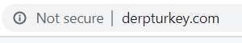
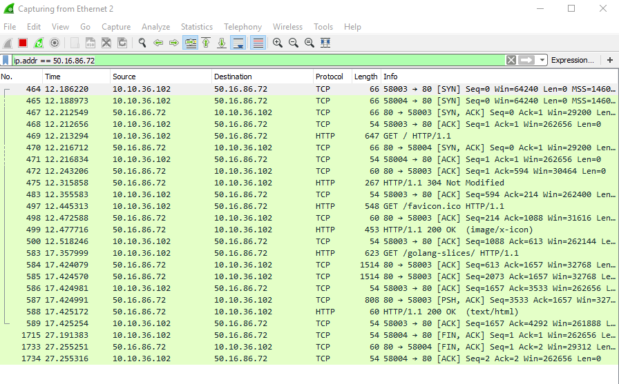

## Public Key Cryptography

You might have noticed that, when browsing on the internet you will occasionally see different icons to the left of the url bar.

If we go to some random [blog](http://derpturkey.com/), we see an information icon with "Not secure" text.



If we click on the icon, we get some scary red text reiterating that our connection is indeed not secure. 

(image)


 But don't unplug your computer and hide under the bed just yet.  That warning is just telling you that the website's server is using HTTP.  HTTP just means that the traffic is unencrypted and could be intercepted without any real effort (as we'll see shortly).  

In this case, I think the attempt to scare you away from derpturkey.com is a little overblown.  After all, it's just a blog.  You go there, you read the content, and then you leave.  <i>You</i> aren't sending any data, and you certainly aren't sending any sensitive date.

But most browser makers take a 'better safe than sorry' approach to informing users.  However, if you are going to be sending data that you wouldn't want the whole world to see, then you should encrypt your data before you send it--with HTTPS.

Encryption is the difference between HTTP and HTTPS.  Before we get into how all of this works, let's try intercepting some traffic from an HTTP connection and then an HTTPS connection.

### (Wireshark example)
In order to to that, we are going to use a very common networking tool called Wireshark.  You can download it for free [here](https://www.wireshark.org/download.html).

Hopefully, after using Wireshark, you'll be just a little bit more paranoid about web security.  Let's just let it run for a minute and see what we get:

(run capture)


Depending on what you were doing, you probably got quite a bit more than you were expecting.  All that output can be overwhelming, so we're going to narrow things down a bit.

Since Wireshark can capture just about everying on your network, we are going to narrow it down.  Let's first look at derpturkey.com, a Javascript coding blog.  We'll first get the ip address

```bash
curl derpturkey.com -v
```
If you look at the first couple lines of output, you will see derpturkey.com's ip address: 50.16.86.72.  We can use this to filter our capture:

```bash
ip.addr == 50.16.86.72
```
(image)

Now try clicking somewhere, and see what happens.  You should see a bunch of packets start to populate your screen.  If you look at the "protocol" columnn, you will notice that some are TCP and others are HTTP.  If you double-click on one of the packets, you'll get a popup window.  In the top pane of the window, you have five lines.  Each one of those lines is a "layer" in the network.  They go from low-level to high-level.  The first line is the lowest layer, and the last is HTTP.  

This brings us to the so-called OSI model.  The OSI model has either 7 or 5 layers, but for our purposes, 5 is fine.  

https://docs.oracle.com/cd/E19683-01/806-4075/ipov-10/index.html


The higher the numbers go, the more abstract things get.  We spend most of our time at the very top of the OSI model, but it's not a bad idea to know a little bit about the lower layers.

We already know a little something about the Network layer (IP), and we'll be playing around with the Transport layer too (TCP UDP)

Feel free to click around, but for now we only care about the HTTP layer.  

If you expand the Hypertext Transfer Protocol line, you should see some familiar faces.  The kind of request (GET), the different headers, and so on.

In the bottom window we have the raw bytes on the left and the slightly-easier-to-read utf-8 encoding on the right.  These are the chunks that make up the flow of the internet.

Wireshark also allows us to take a look at an entire conversation.  Choose a packet, right-click it, then follow, then HTTP stream.  You should see the whole conversation laid out for you.  

This packet capture represents the detailed history of our internet browsing.  It's a good thing we didn't send anything important over the wire!

Now let's do the same with with a server that uses HTTPS:

```bash
curl google.com -v
```

```bash
ip.addr == 172.217.8.206  //use duckduckgo, search for network security
```

Here you'll notice a couple differences.  First off, the protocols are different.  Instead of HTTP, we have TLS.  What other differences do you notice? 
    -port, encrypted application data is gibberish

Here we have no idea what information we were sending to the server.  So even if someone had intercepted this, they wouldn't be able to do anything with it. 


### Certificates
But how does this encryption happen?  The answer it: certificates.  Let's go to a webpage that uses HTTPS.

```bash
duckduckgo.com
```

If we click on the "lock" icon to the left of the url bar, instead of scary red text, reassuring green:


We can continue to find out more if we click on the certificate.  The certificate actually has quite a bit of information in it.  Take a quick look.

It turns out the duckduckgo.com's certificate doesn't just contain information about itself, but also information about the certificate (DigiCert SHA2 Secure Server CA) that is vouching for duckduckgo.com's certificate.

And if we do the same thing with DigiCert SHA2 Secure Server CA's certificate, we find that it was issued by DigiCert Global Root CA.  

Wait, so the same company, DigiCert is issuing certificates to itself?  It turns out that the entire system of credibility that undergirds encrytption on the internet is just a small group of big companies saying that they trust each other--so you can trust who they trust.  Yikes!

But it seems to be working for the moment.  Those top level players are called Certificate Authorities, and all roads lead to them.

The chain of certificates that starts with duckduckgo.com leads up to one of the elect Certificate Authorities, in this case DigiCert Global Root CA.  

Go to you settings in Google Chrome and search for "Manage Certificates".  Eventually you should be able to see all of the certificates from the Certificate Authorities:


Yes, you've had all these certificates the whole time.  Later on, you'll see what happens when that certificate chain has a broken link, and what you might be able to do to fix it.


### Back to HTTPS
Now that we know a little bit about the mechanism that enables trust on the internet, let's get back to our packets.

We saw some TCP packets that preceeded either the HTTP or TLS protocols.  HTTPS adds some extra steps to the initial interaction between a client (browser) and a server. Before sending the application data (OSI layer 7), there is what is called a "TLS handshake".  The TLS handshake is when the encryption is negotiated.

 The end result of all these steps is an agreement between the client and the browser to use a specific encryption mechanism.  So when you send your credit card number in a form, even if someone intercepts the message (very easy to do as we'll see), there won't be anything useful for a potential attacker to steal.

(Wireshark)

We are going to present a somewhat simplified overview of that negotiation.

// https://www.thesslstore.com/blog/explaining-ssl-handshake/

1. Exchange encryption capabilities
2. authenticate the certificate
3. exchange session key


#### Exchange encryption Capabilities

The client must tell the server what kinds of encrytion it can handle


#### authenticate the certificate

The server sends the client, not just it's own certificate (called a "leaf", because it is at the end of the "branch"), but a chain of certificates.  The client then checks that the chain leading from the server's leaf certificate all the way up to the Certificate Authority is valid.  It must ensure that the chain matches, the certificates are not expired, and the certificates have not been revoked.  

With HTTPS, before any application data is sent, the server sends the browser its certificate.  A certificate is basically just a filled out form that is meant to prove that the server is who it says it is.  


How does this happen?  The short answer is: certificates.

HTTPS uses encryption 

TLS handshake

(show flow diagram)

Certificate Authorities

(click on certificates in the browser)


The initial connection is asymmetric.  The client encrypts data using the server's public key.  Then, once the client and server agree on a session key (a symmetric key), they can have two-way encrypted communication.

Let's take a short break to talk about how asymmetric keys can be used to generate symmetric keys:

## Ceasar Cipher Example
We already know about the Ceasar Cipher.  If you want to exchange encrypted letters with someone using a Ceasar Cipher, you both need to have the same secret number.  But if you are the writer, how do you tell your reader what the secret number is?  You can't simply write in in the top corner of the letter, because anyone who intercepts the letter would be able to decode it.  There are some ways around this.  You might have a dead-drop that you both know about, where you can place the secret number.  But then how do you securely communicate about the dead-drop's location...  It seems like an infinite regression.

Fortunately, there is some math thing that solves this problem for us.  In fact, it is the basis of secure communication on the internet--the "S" in HTTPS.  

Through some kind of magic, public key cryptography allows two people to share encrypted information even when the encryptor uses a publicly available key.  It sounds strange, but here is how it goes.

Alice and Bob want to pass secret messages to each other.  Here is what they do:
Alice generates two very large numbers that are mathematically related, but impossible to guess
Alice keeps one of them to herself <b>(private key)</b>, and posts the other one publicly as her pinned Tweet<b>(public key)</b>.

Bob does the same thing.  
Bob generates two very large numbers that are mathematically related, but impossible to guess.
Bob keeps one of them to himself <b>(private key)</b>, and posts the other one publicly as his pinned Tweet <b>(public key)</b>.

When Bob wants to send a message to Alice, he encrypts his message with <i>Alice's</i> <b>(public key)</b>.  Alice then uses her <b>(private key)</b> to decrypt Bob's message.

The same thing happens when Alice wants to send a message to Bob:
When Alice wants to send a message to Bob, she encrypts her message with <i>Bob's</i> <b>(public key)</b>.  Bob then uses his <b>(private key)</b> to decrypt Alice's message.


It sounds crazy, and it involves math that I won't bother trying to figure out, but we can build a very simple model that shows how it works using very small numbers.

We'll use a Ceasar Cipher to show how Alice and Bob can send an receive encrypted messages without knowing the other's private key.  

Here is how the keys are generated:

```python
# public_key_cryptography.py
import random

class Key:
    def __init__(self, public_key_base, public_key_modulus):
        self.public_key_base = public_key_base
        self.public_key_modulus = public_key_modulus
        self.private_key = random.randint(1,100) 

    def generate_public_key(self):
        return pow(self.public_key_base, self.private_key) % self.public_key_modulus

    def generate_shared_secret(self, another):
        return pow(another, self.private_key) % self.public_key_modulus


def return_shared_secret():
    public_key_base = 3  
    public_key_modulus = 23 
    
    alice_private_secret = Key(public_key_base, public_key_modulus)
    bob_private_secret = Key(public_key_base, public_key_modulus)
    shared_secret_alice = alice_private_secret.generate_shared_secret(bob_private_secret.generate_public_key())
    shared_secret_bob = bob_private_secret.generate_shared_secret(alice_private_secret.generate_public_key())

    return {
        "shared_secret_alice": shared_secret_alice,
        "shared_secret_bob": shared_secret_bob
    }
```

Feel free to let your eyes glaze over.  The point is that, through some mathmatical wizardry, both Alice and Bob end up deciding on the same number for the Ceasar Cipher.

If we now run alice_bob_message_exchange.py, we see that an encrypted message can be sent and received, even though both parties have withheld information.


## Challenges

#### Wireshark

    -DNS packet analysis
    -observing the wire (authentication) http://www-net.cs.umass.edu/wireshark-labs/Wireshark_HTTP_v7.0.pdf       http://gaia.cs.umass.edu/wireshark-labs/protected_pages/HTTP-wireshark-file5.html
        -we will learn more about base64 encoding when we talk about JSON Web Tokens


#### Create HTTPS Server
    -Create server
    -Add HTTPS
    -Make your browser trust the cert
    -Create a certificate chain